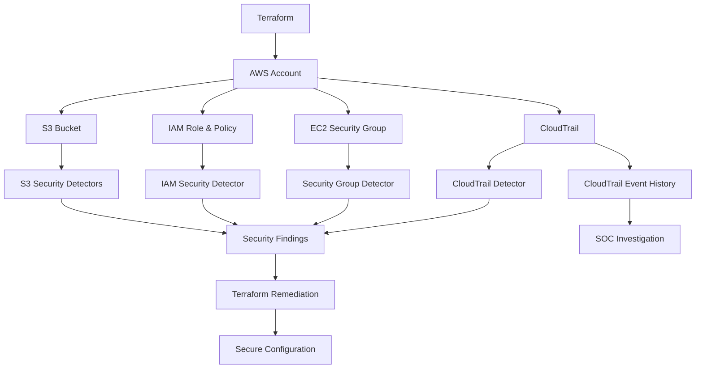

# AWS Cloud Security Lab

A hands-on AWS cloud security lab built with **Terraform, AWS CLI, Python, and Boto3** to simulate common cloud misconfigurations, detect them programmatically, remediate them using Infrastructure as Code, and verify the resulting secure state.

The lab contains **5 security scenarios** covering storage security, IAM, network security, encryption enforcement, and cloud monitoring.

---

## Project Overview

Cloud environments can become vulnerable through configuration drift, excessive permissions, exposed management services, missing security controls, and disabled logging.

This project simulates these conditions in a controlled AWS environment and follows a repeatable security workflow:

```text
Secure Baseline
      |
      v
Intentional Misconfiguration
      |
      v
AWS Configuration Verification
      |
      v
Automated Detection
      |
      v
Security Finding
      |
      v
Terraform Remediation
      |
      v
Post-Remediation Verification
      |
      v
Secure State
```

The project also includes a SOC-oriented investigation component using **AWS CloudTrail** to investigate the API activity responsible for a monitoring-control failure.

---

## Objectives

- Provision AWS security controls using Terraform
- Establish secure cloud configuration baselines
- Intentionally introduce realistic cloud security misconfigurations
- Verify misconfigurations against the live AWS environment
- Develop Python/Boto3 security detection scripts
- Generate security findings with severity, risk, and remediation guidance
- Remediate misconfigurations using Terraform
- Verify the remediated state through AWS CLI and automated detection
- Investigate AWS API activity using CloudTrail
- Demonstrate a repeatable **Detect → Investigate → Remediate → Verify** workflow

---

## Architecture



---

## Security Workflow

Each scenario follows the same general methodology:

```text
1. Secure Baseline
        |
        v
2. Intentional Misconfiguration
        |
        v
3. Live AWS Verification
        |
        v
4. Automated Detection
        |
        v
5. Security Finding
        |
        v
6. Terraform Remediation
        |
        v
7. AWS Verification
        |
        v
8. Detector PASS
```

This ensures that the security control is tested against the **actual AWS environment**, rather than only checking the Terraform source code.

---

# Security Scenarios

| # | Scenario | Security Area | Detection | Severity |
|---|---|---|---|---|
| 01 | [S3 Public Access](scenarios/01-s3-public-access/README.md) | Storage Security | Boto3 | HIGH |
| 02 | [Excessive IAM Permissions](scenarios/02-excessive-iam/README.md) | Identity & Access | Boto3 | CRITICAL |
| 03 | [Overly Permissive Security Group](scenarios/03-security-group/README.md) | Network Security | Boto3 | HIGH |
| 04 | [S3 Encryption Enforcement](scenarios/04-s3-encryption-enforcement/README.md) | Data Protection | Boto3 | HIGH |
| 05 | [CloudTrail Logging & Monitoring](scenarios/05-cloudtrail-logging-and-monitoring-misconfiguration/README.md) | Security Monitoring / SOC | Boto3 + CloudTrail | HIGH |

---

# Scenario 01 — S3 Public Access Misconfiguration

### Security Focus

**Amazon S3 Block Public Access**

The scenario intentionally disables the four S3 Block Public Access controls:

```text
BlockPublicAcls
IgnorePublicAcls
BlockPublicPolicy
RestrictPublicBuckets
```

The detector identifies the insecure configuration and Terraform restores the secure baseline.

### Detection

```text
[HIGH] S3 Public Access Protection Misconfiguration
```

### Remediation

All four Block Public Access controls are restored to:

```text
true
```

### Final Verification

```text
[PASS] S3 public-access protection is securely configured.
```

[View Scenario 01 →](scenarios/01-s3-public-access/README.md)

---

# Scenario 02 — Excessive IAM Permissions

### Security Focus

**Principle of Least Privilege**

The secure IAM policy allows only:

```text
Action   = s3:GetObject
Resource = <lab-bucket>/*
```

The intentionally vulnerable configuration changes this to:

```text
Action   = *
Resource = *
```

The Boto3 detector identifies both wildcard permissions.

### Detection

```text
[CRITICAL] Excessive IAM Permissions Detected
```

### Findings

```text
Wildcard Action (*)
Wildcard Resource (*)
```

### Remediation

The policy is restored to:

```text
Action   = s3:GetObject
Resource = <lab-bucket>/*
```

### Final Verification

```text
[PASS] IAM policy follows the expected least-privilege checks.
```

[View Scenario 02 →](scenarios/02-excessive-iam/README.md)

---

# Scenario 03 — Overly Permissive Security Group

### Security Focus

**Network Access Control**

The secure baseline restricts SSH access to the administrator's trusted IP using a `/32` CIDR range.

The intentionally vulnerable configuration changes SSH access to:

```text
TCP 22
0.0.0.0/0
```

This exposes the SSH management service to every IPv4 address.

### Detection

```text
[HIGH] Security Group Misconfiguration Detected
```

### Remediation

SSH access is restored from:

```text
0.0.0.0/0
```

to:

```text
Administrator IP/32
```

### Final Verification

```text
[PASS] Security Group follows the expected network security checks.
```

[View Scenario 03 →](scenarios/03-security-group/README.md)

---

# Scenario 04 — S3 Encryption Enforcement

### Security Focus

**Data Protection & Defense in Depth**

The S3 bucket uses SSE-S3:

```text
SSEAlgorithm = AES256
```

An additional bucket-policy control explicitly denies object uploads that do not specify:

```text
s3:x-amz-server-side-encryption = AES256
```

The intentionally vulnerable configuration removes this enforcement policy.

> This scenario does not simulate an unencrypted S3 bucket. S3 default server-side encryption remains enabled. The simulated issue is the removal of the explicit policy-level encryption enforcement control.

### Detection

```text
[HIGH] S3 Encryption Enforcement Misconfiguration Detected
```

### Remediation

The `DenyUnencryptedObjectUploads` policy is restored.

### Final Verification

The live bucket policy is verified and the detector confirms the expected encryption-enforcement control.

[View Scenario 04 →](scenarios/04-s3-encryption-enforcement/README.md)

---

# Scenario 05 — CloudTrail Logging & Monitoring Misconfiguration

### Security Focus

**Cloud Security Monitoring & SOC Investigation**

CloudTrail is configured as a multi-Region trail with:

```text
Management Events = Enabled
Read Events      = Enabled
Write Events     = Enabled
Global Events     = Enabled
Log Validation    = Enabled
```

Logs are delivered to the lab S3 bucket.

The scenario intentionally stops CloudTrail logging:

```text
IsLogging = false
```

### Detection

The Boto3 detector identifies the disabled logging state:

```text
[HIGH] CloudTrail Logging Misconfiguration Detected
```

### SOC Investigation

CloudTrail Event History is used to investigate the:

```text
StopLogging
```

API event.

Relevant investigation fields include:

```text
eventTime
eventSource
eventName
awsRegion
sourceIPAddress
userIdentity
requestParameters
eventType
managementEvent
```

### Remediation

CloudTrail logging is restored:

```text
IsLogging = true
```

### Final Verification

```text
[PASS] CloudTrail logging is enabled.
```

A subsequent AWS API event is also queried to verify that activity is being recorded again.

[View Scenario 05 →](scenarios/05-cloudtrail-logging-and-monitoring-misconfiguration/README.md)

---

# Detection Framework

The detection layer contains five Python scripts.

```text
detection/
├── cloudtrail_logging_detector.py
├── iam_excessive_permissions_detector.py
├── s3_encryption_detector.py
├── s3_misconfiguration_detector.py
└── security_group_misconfiguration_detector.py
```

Each detector uses **Boto3** to inspect the live AWS configuration.

| Detector | AWS Service | Security Control |
|---|---|---|
| `s3_misconfiguration_detector.py` | S3 | Block Public Access |
| `iam_excessive_permissions_detector.py` | IAM | Least Privilege |
| `security_group_misconfiguration_detector.py` | EC2 | SSH Network Exposure |
| `s3_encryption_detector.py` | S3 | Encryption Enforcement |
| `cloudtrail_logging_detector.py` | CloudTrail | Active Logging |

---

## Detection Model

The detectors follow a simple control-assessment model:

```text
                    AWS API
                       |
                       v
                 Boto3 Detector
                       |
                       v
              Security Control
                       |
             +---------+---------+
             |                   |
             v                   v
        Secure State       Insecure State
             |                   |
             v                   v
            PASS               Finding
                                 |
                                 v
                           Recommendation
```

The detectors return a non-zero exit status when the expected security control fails, allowing them to be incorporated into future automated security checks or CI/CD workflows.

---

# Infrastructure as Code

Terraform is used to provision and manage the AWS security lab.

```text
terraform/
├── .terraform.lock.hcl
├── main.tf
├── variables.tf
├── outputs.tf
├── iam.tf
├── security_group.tf
├── s3_security_policy.tf
└── cloudtrail.tf
```

The infrastructure includes:

- S3 bucket
- S3 Block Public Access
- S3 ownership controls
- S3 server-side encryption
- S3 versioning
- S3 security policies
- IAM role and policy
- EC2 Security Group
- CloudTrail trail
- CloudTrail S3 log delivery

Terraform uses the AWS provider and the lab defaults to:

```text
Region: ap-south-1
```

The administrator IP is supplied as a Terraform variable rather than being hard-coded into the repository.

---

# Repository Structure

```text
Cloud-Security-Lab/
│
├── README.md
├── .gitignore
│
├── detection/
│   ├── cloudtrail_logging_detector.py
│   ├── iam_excessive_permissions_detector.py
│   ├── s3_encryption_detector.py
│   ├── s3_misconfiguration_detector.py
│   └── security_group_misconfiguration_detector.py
│
├── scenarios/
│   ├── 01-s3-public-access/
│   │   └── README.md
│   │
│   ├── 02-excessive-iam/
│   │   └── README.md
│   │
│   ├── 03-security-group/
│   │   └── README.md
│   │
│   ├── 04-s3-encryption-enforcement/
│   │   └── README.md
│   │
│   └── 05-cloudtrail-logging-and-monitoring-misconfiguration/
│       └── README.md
│
├── screenshots/
│   └── Security evidence and verification screenshots
│
└── terraform/
    ├── .terraform.lock.hcl
    ├── main.tf
    ├── variables.tf
    ├── outputs.tf
    ├── iam.tf
    ├── security_group.tf
    ├── s3_security_policy.tf
    └── cloudtrail.tf
```

---

# Prerequisites

The lab requires:

- An AWS account
- AWS CLI
- Terraform `>= 1.5.0`
- Python 3
- Boto3
- Git

The AWS CLI must be authenticated with an identity that has sufficient permissions to create and modify the lab resources.

---

# Setup

## 1. Clone the Repository

```powershell
git clone https://github.com/VishwajeetRoy/Cloud-Security-Lab.git
cd Cloud-Security-Lab
```

## 2. Verify AWS Authentication

```powershell
aws sts get-caller-identity
```

The command should return the authenticated AWS identity.

---

## 3. Install Python Dependencies

```powershell
pip install boto3
```

---

## 4. Configure Terraform Variables

Create:

```text
terraform/terraform.tfvars
```

with:

```hcl
aws_region = "ap-south-1"
admin_ip   = "YOUR_PUBLIC_IP/32"
```

`terraform.tfvars` is intentionally excluded from Git tracking.

---

## 5. Initialize Terraform

```powershell
terraform -chdir=terraform init
```

---

## 6. Review the Infrastructure Plan

```powershell
terraform -chdir=terraform plan
```

Review the planned resources before applying them.

---

## 7. Deploy the Lab

```powershell
terraform -chdir=terraform apply
```

Type:

```text
yes
```

when prompted.

---

# Running the Detectors

The detection scripts can be executed from the repository root.

### S3 Public Access

```powershell
python detection\s3_misconfiguration_detector.py
```

### Excessive IAM Permissions

```powershell
python detection\iam_excessive_permissions_detector.py
```

### Security Group

```powershell
python detection\security_group_misconfiguration_detector.py
```

### S3 Encryption Enforcement

```powershell
python detection\s3_encryption_detector.py
```

### CloudTrail Logging

```powershell
python detection\cloudtrail_logging_detector.py
```

Each detector evaluates the live AWS configuration and reports whether the expected security control is present.

---

# AWS Services Used

| AWS Service | Purpose |
|---|---|
| Amazon S3 | Storage security, encryption and CloudTrail log destination |
| AWS IAM | Identity and least-privilege access control |
| Amazon EC2 | Security Group network controls |
| AWS CloudTrail | API activity logging and SOC investigation |
| AWS STS | AWS identity verification |

---

# Tools & Technologies

| Technology | Role |
|---|---|
| Terraform | Infrastructure as Code |
| AWS CLI | Configuration assessment and verification |
| Python | Security automation |
| Boto3 | AWS API interaction |
| AWS CloudTrail | Audit logging and investigation |
| Git/GitHub | Version control and documentation |

---

# Security Evidence

The repository contains screenshots demonstrating:

- AWS CLI authentication
- Terraform initialization
- Secure baseline configuration
- Terraform plans
- Intentional misconfigurations
- Live AWS verification
- Automated security findings
- Remediation plans
- Post-remediation verification
- CloudTrail investigation
- CloudTrail post-remediation event logging

All scenario documentation references the corresponding evidence in:

```text
screenshots/
```

---

# Security & Cost Considerations

This project intentionally creates and modifies AWS resources for security testing.

Before deploying the lab:

- Review the Terraform plan.
- Verify the AWS Region.
- Monitor AWS resource usage.
- Remove resources when the lab is no longer required.
- Do not commit AWS credentials, access keys, private keys, Terraform state, or local Terraform variables.

To remove the Terraform-managed infrastructure:

```powershell
terraform -chdir=terraform destroy
```

Review the destruction plan carefully before confirming.

> AWS services may incur charges depending on account configuration, usage, retention, and applicable free-tier limits.

---

# What This Project Demonstrates

This lab demonstrates practical skills across several cloud-security areas:

### Cloud Security

- AWS security configuration assessment
- Secure configuration baselines
- Configuration drift identification
- Defense-in-depth controls

### IAM Security

- Least privilege
- IAM policy analysis
- Wildcard permission detection
- Permission remediation

### Network Security

- Security Group analysis
- SSH exposure detection
- CIDR-based access restriction
- Network-layer least privilege

### Data Security

- S3 Block Public Access
- Server-side encryption
- Encryption enforcement policies
- Secure object storage configuration

### Security Monitoring & SOC

- CloudTrail configuration
- Management event logging
- Detection of disabled logging
- CloudTrail Event History investigation
- Investigation of `StopLogging`
- Post-remediation event verification

### Security Automation

- Python
- Boto3
- Automated configuration checks
- Severity-based findings
- Remediation recommendations
- Exit-status-based security validation

### Infrastructure as Code

- Terraform resource management
- Reproducible security baselines
- Intentional configuration drift
- Terraform-based remediation

---

# Project Methodology

The project follows a repeatable cloud security assessment methodology:

```text
                ┌───────────────────┐
                │  Secure Baseline  │
                └─────────┬─────────┘
                          │
                          v
                ┌───────────────────┐
                │ Misconfiguration  │
                │    Simulation     │
                └─────────┬─────────┘
                          │
                          v
                ┌───────────────────┐
                │  AWS Verification │
                └─────────┬─────────┘
                          │
                          v
                ┌───────────────────┐
                │ Automated Detect  │
                └─────────┬─────────┘
                          │
                          v
                ┌───────────────────┐
                │ Security Finding  │
                └─────────┬─────────┘
                          │
                          v
                ┌───────────────────┐
                │    Remediation    │
                │    via Terraform  │
                └─────────┬─────────┘
                          │
                          v
                ┌────────────────────┐
                │ Final Verification │
                └─────────┬──────────┘
                          │
                          v
                ┌───────────────────┐
                │   Secure State    │
                └───────────────────┘
```

---

# Key Takeaways

- Cloud security requires continuous assessment rather than relying only on initial configuration.
- Infrastructure as Code can be used to establish and restore security baselines.
- AWS CLI provides an independent way to verify the actual deployed state.
- Boto3 can automate cloud-security configuration checks.
- Security findings can be generated from live AWS configuration data.
- Least privilege applies to both IAM permissions and network access.
- Defense-in-depth controls can strengthen cloud security beyond default service behavior.
- CloudTrail provides valuable audit data for security investigations.
- Disabled logging can create a significant monitoring gap.
- Combining configuration detection with CloudTrail investigation provides a more complete SOC-oriented workflow.
- Post-remediation verification is necessary to confirm that the intended security state was actually restored.

---

## License

This project is intended as an educational cloud-security laboratory and portfolio project.