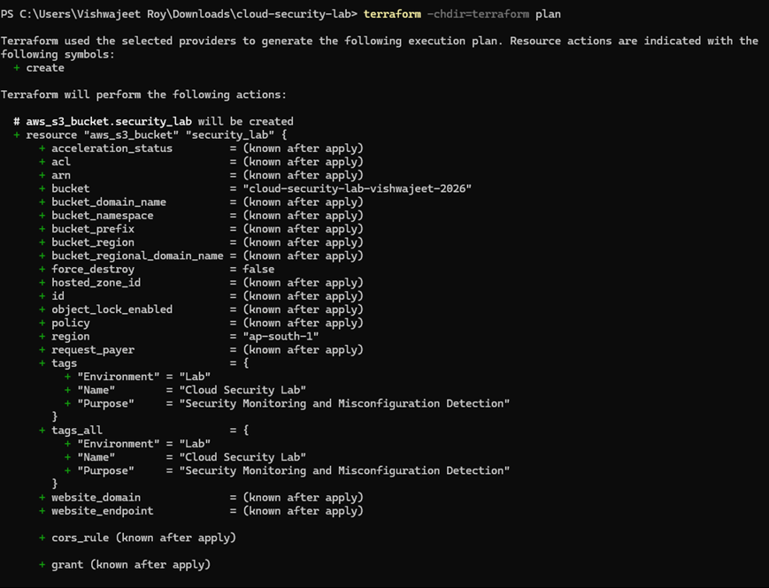
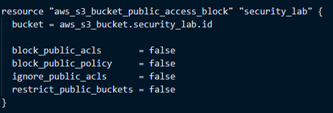
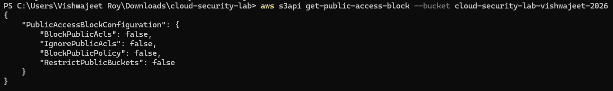
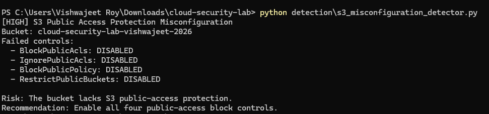
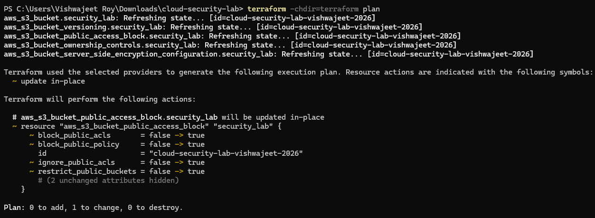
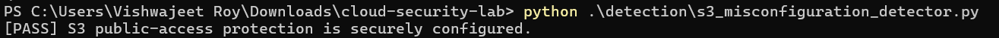

# Scenario 01 — S3 Public Access Misconfiguration

## Objective

Identify and remediate an insecure Amazon S3 public-access configuration using Infrastructure as Code and automated security detection.

This scenario demonstrates:

- Secure S3 configuration
- Intentional security misconfiguration
- AWS configuration assessment
- Automated detection using Python/Boto3
- Terraform-based remediation
- Post-remediation verification

---

## Security Concept

Amazon S3 provides object storage through containers called **buckets**.

A major cloud security risk is accidentally exposing stored data to unauthorized users through insecure bucket policies, ACLs, or public-access settings.

AWS provides four S3 **Block Public Access** controls that help prevent accidental public exposure:

- `BlockPublicAcls`
- `IgnorePublicAcls`
- `BlockPublicPolicy`
- `RestrictPublicBuckets`

The secure baseline enabled all four controls.

The intentionally vulnerable configuration disabled all four controls to simulate a cloud storage security misconfiguration.

---

## Architecture

```text
                         AWS Account
                              |
                              v
                         S3 Bucket
                    cloud-security-lab
                              |
                 +------------+------------+
                 |                         |
                 v                         v
          Secure Baseline          Misconfigured State
            Public Access             Public Access
             Blocked                   Protection Disabled
                 |                         |
                 +------------+------------+
                              |
                              v
                      AWS CLI Assessment
                              |
                              v
                    Boto3 Detection Script
                              |
                              v
                       HIGH Finding
                              |
                              v
                    Terraform Remediation
                              |
                              v
                     Secure Configuration
                              |
                              v
                            PASS
```

---

# 1. Secure S3 Baseline

The S3 bucket was provisioned using Terraform with security controls designed to reduce the risk of accidental public exposure.

The secure baseline included:

```text
BlockPublicAcls       = true
IgnorePublicAcls      = true
BlockPublicPolicy     = true
RestrictPublicBuckets = true
```

Additional baseline controls included:

- Server-side encryption using AES256
- Bucket owner enforced object ownership
- S3 versioning enabled

### Terraform Plan



The Terraform plan shows the S3 bucket and its security controls being provisioned.

---

# 2. Intentional Misconfiguration

To simulate a real-world cloud security misconfiguration, the four S3 Block Public Access controls were intentionally disabled using Terraform.

The configuration was changed to:

```text
BlockPublicAcls       = false
IgnorePublicAcls      = false
BlockPublicPolicy     = false
RestrictPublicBuckets = false
```

This removes the protective controls that help prevent public S3 access configurations.

### Terraform Misconfiguration Plan



The Terraform plan shows the public-access protection controls being changed from `true` to `false`.

---

# 3. Misconfiguration Verification

After deploying the intentional misconfiguration, the AWS CLI was used to query the actual S3 configuration.

The resulting configuration confirmed:

```text
BlockPublicAcls       = false
IgnorePublicAcls      = false
BlockPublicPolicy     = false
RestrictPublicBuckets = false
```



This confirmed that the insecure state existed in the actual AWS environment rather than only in the Terraform configuration.

---

# 4. Automated Detection

A Python-based security detector was developed using **Boto3**, the AWS SDK for Python.

The detector queries the S3 API and evaluates the bucket's Block Public Access configuration.

### Detection Logic

The detector:

1. Connects to Amazon S3 using Boto3.
2. Retrieves the bucket's public-access configuration.
3. Checks all four Block Public Access controls.
4. Identifies disabled security controls.
5. Generates a security finding.
6. Reports the affected controls and remediation recommendation.

### Detection Flow

```text
Python Script
     |
     v
   Boto3
     |
     v
AWS S3 API
     |
     v
Retrieve Public Access Configuration
     |
     v
Check Four Security Controls
     |
     +------------------------+
     |                        |
 All Enabled             Any Disabled
     |                        |
     v                        v
   PASS                 HIGH Finding
                              |
                              v
                       Remediation
```

### Detection Result



The detector identified the insecure configuration and reported:

```text
[HIGH] S3 Public Access Protection Misconfiguration
```

The disabled controls were listed individually and a remediation recommendation was provided.

---

# 5. Remediation

The Terraform configuration was restored to the secure baseline:

```text
BlockPublicAcls       = true
IgnorePublicAcls      = true
BlockPublicPolicy     = true
RestrictPublicBuckets = true
```

Terraform was then used to apply the secure configuration to AWS.

### Remediation Plan



The Terraform plan shows the public-access protection controls being restored.

---

# 6. Final Verification

### Automated Post-Remediation Verification

The Boto3 detector was executed again after remediation and confirmed that all S3 public-access protection controls were securely configured.



The detector returned:

```text
[PASS] S3 public-access protection is securely configured.
```
---

# 7. Security Impact

Disabling S3 Block Public Access controls increases the risk of accidental or intentional public exposure of stored data.

If an S3 bucket is subsequently configured with a public policy or ACL, data may become accessible to unauthorized users.

Potential impact includes:

- Exposure of sensitive files
- Unauthorized data access
- Data leakage
- Increased attack surface
- Compliance and privacy risks

The scenario demonstrates why cloud storage configurations should be continuously assessed rather than assumed to remain secure after initial deployment.

---

# 8. Tools Used

| Tool | Purpose |
|---|---|
| Amazon S3 | Cloud object storage |
| Terraform | Infrastructure as Code and remediation |
| AWS CLI | Configuration assessment and verification |
| Python | Security automation |
| Boto3 | AWS API interaction |
| Git/GitHub | Version control and project documentation |

---

# 9. Scenario Workflow

```text
                  Secure S3 Baseline
                         |
                         v
              Public Access Protected
                         |
                         v
            Intentional Misconfiguration
                         |
                         v
               Public Access Protection
                      Disabled
                         |
                         v
                AWS CLI Assessment
                         |
                         v
              Boto3 Security Detector
                         |
                         v
                     HIGH Finding
                         |
                         v
                Terraform Remediation
                         |
                         v
              Restore Secure Controls
                         |
                         v
                  AWS Verification
                         |
                         v
                   Secure State
```

---

# 10. Key Takeaways

- S3 public-access controls are important security safeguards against accidental data exposure.
- Cloud infrastructure should be assessed against a defined secure baseline.
- AWS configuration can be queried programmatically using Boto3.
- Terraform provides a reproducible method for both deploying and remediating cloud configurations.
- Automated detection can identify insecure cloud configurations before they result in data exposure.
- Verification after remediation confirms that the intended security state has actually been restored.

---

# Evidence Summary

| Stage | Evidence |
|---|---|
| Secure S3 baseline | `s3-terraform-plan-1.png` |
| Intentional misconfiguration | `s3-misconfiguration-plan-1.png` |
| Misconfiguration verification | `s3-misconfiguration-verified.png` |
| Automated detection | `s3-misconfiguration-detected.png` |
| Remediation | `s3-remediation-plan.png` |
| Post-remediation detection | `s3-remediation-verified.png` |