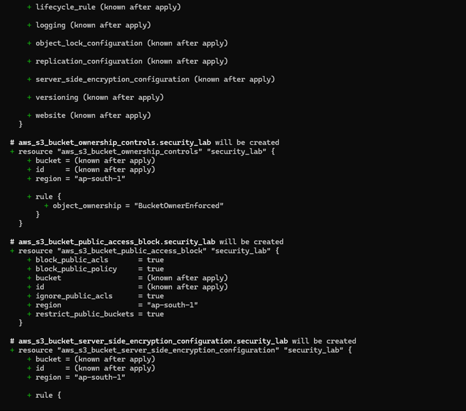
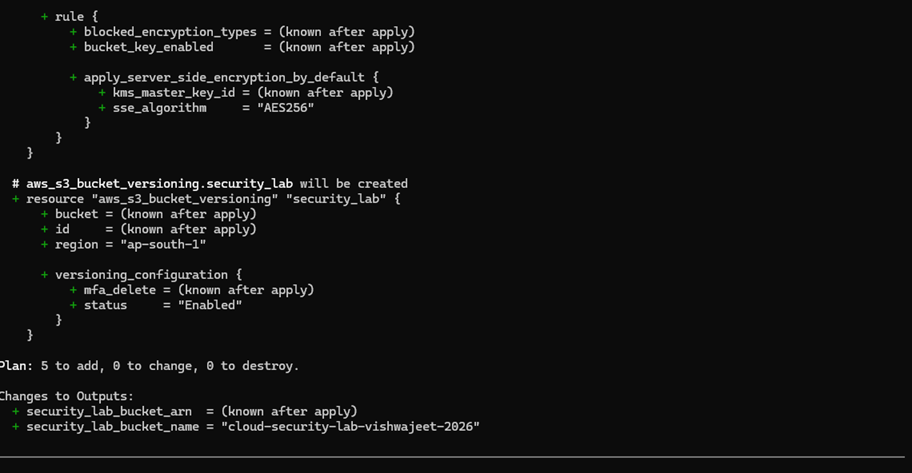
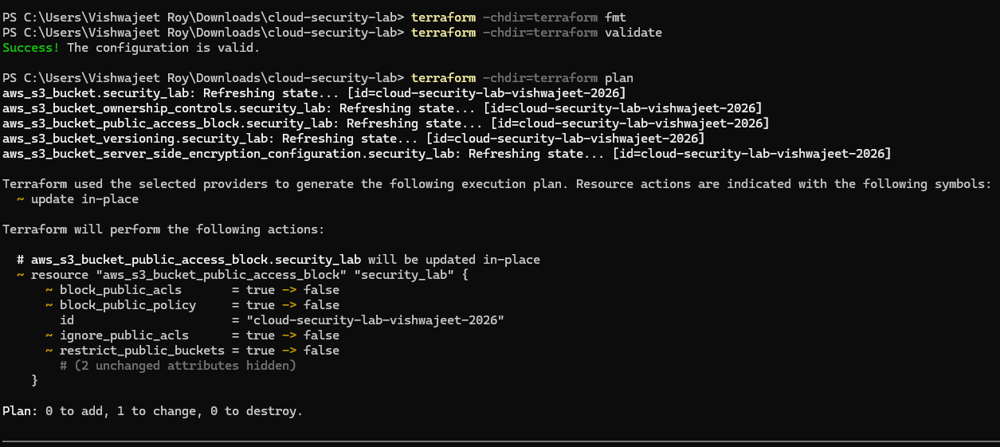
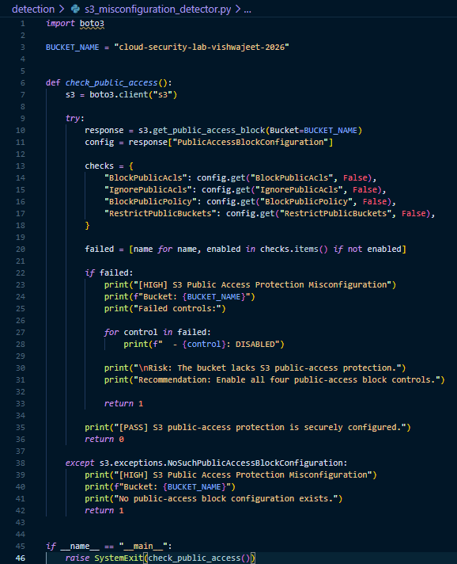

# Scenario 01 — S3 Public Access Misconfiguration

## Objective

Identify and remediate insecure S3 public-access configuration.

## Secure Baseline

The S3 bucket was configured with:

- BlockPublicAcls enabled
- IgnorePublicAcls enabled
- BlockPublicPolicy enabled
- RestrictPublicBuckets enabled

## Misconfiguration

The four S3 public-access protection controls were intentionally disabled using Terraform.

## Assessment

The bucket configuration was queried using the AWS CLI to verify that the insecure state existed.

## Detection

`s3_misconfiguration_detector.py` used Boto3 to query the S3 API and identify disabled public-access controls.

Severity: **HIGH**

## Evidence

### 1. Secure S3 Terraform Baseline

Terraform defines the initial secure S3 configuration, including public-access blocking, encryption, ownership controls, and versioning.

### 2. Intentional Misconfiguration

Terraform was modified to disable all four S3 public-access block controls.

### 3. Misconfiguration Verification

The AWS CLI confirmed that all four public-access protection controls were disabled in the deployed S3 bucket.

### 4. Detection

The Python/Boto3 detection script identified the insecure configuration and classified it as a HIGH-severity finding.

### 5. Remediation

Terraform was restored to the secure configuration, changing all four public-access controls back to `true`.

## Remediation

The Terraform configuration was restored to the secure baseline and applied.

## Verification

The S3 public-access configuration was queried again using the AWS CLI and all four controls were confirmed enabled.

## Security Impact

Disabling S3 public-access protection increases the risk of accidental or intentional public exposure of stored data.

## Lessons Learned

The scenario demonstrated how Infrastructure as Code can be used to introduce, detect, and remediate cloud security misconfigurations.