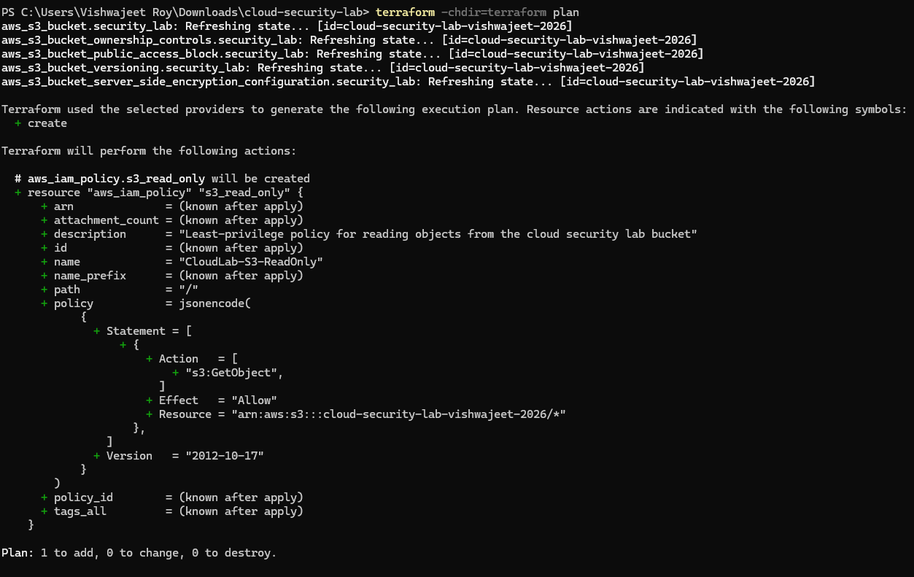
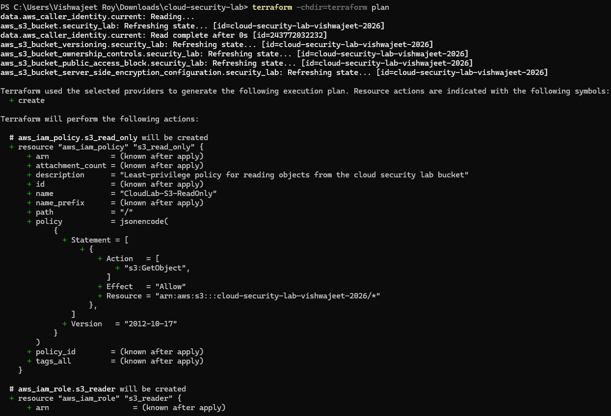
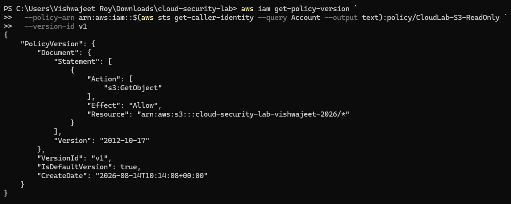
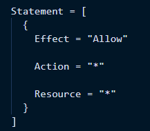
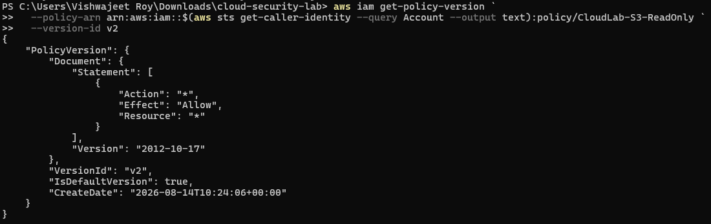
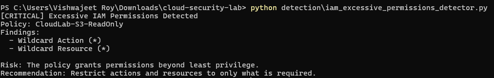
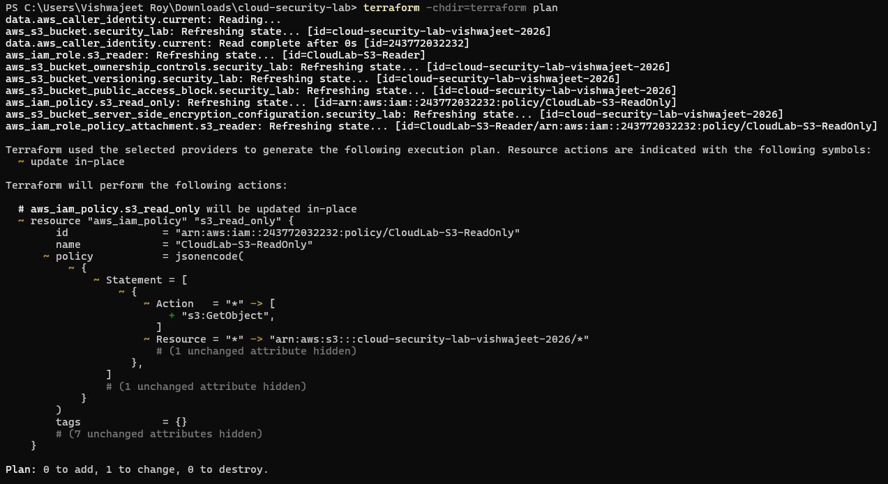
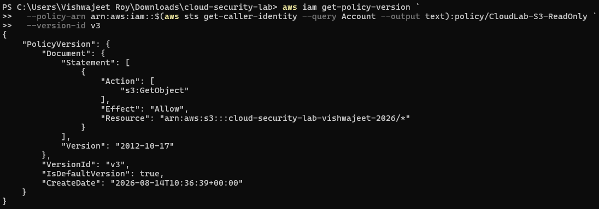
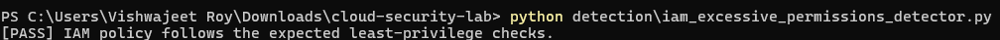

# Scenario 02 — Excessive IAM Permissions

## Objective

Identify and remediate excessive AWS IAM permissions using Infrastructure as Code and automated security detection.

This scenario demonstrates:

- Secure IAM configuration based on least privilege
- Intentional introduction of excessive permissions
- AWS configuration assessment
- Automated detection using Python and Boto3
- Terraform-based remediation
- Post-remediation verification

---

## Security Concept

AWS Identity and Access Management (IAM) controls access to AWS resources by defining which actions an identity is allowed or denied to perform.

This scenario focuses on the **Principle of Least Privilege**.

The secure IAM policy initially allowed only:

```text
Action   = s3:GetObject
Resource = arn:aws:s3:::<lab-bucket>/*
```

This means the role could read objects from the specific lab S3 bucket but was not granted unnecessary permissions.

The intentionally vulnerable configuration changed the policy to:

```text
Action   = *
Resource = *
```

This represents excessive permissions because the identity could potentially perform arbitrary actions against arbitrary AWS resources.

---

## Architecture

```text
                         AWS Account
                              |
                              v
                          IAM Role
                    CloudLab-S3-Reader
                              |
                              v
                  CloudLab-S3-ReadOnly
                              |
                 +------------+------------+
                 |                         |
                 v                         v
          Secure Baseline          Misconfigured State
          s3:GetObject                  Action = *
          Specific Bucket               Resource = *
                 |                         |
                 +------------+------------+
                              |
                              v
                       Boto3 Detector
                              |
                              v
                       Security Finding
                              |
                              v
                    Terraform Remediation
                              |
                              v
                       Least Privilege
                              |
                              v
                             PASS
```

---

# 1. Secure IAM Baseline

A dedicated IAM role named `CloudLab-S3-Reader` was created using Terraform.

The role was attached to an IAM policy named `CloudLab-S3-ReadOnly`.

The initial policy followed least privilege by granting only:

```text
s3:GetObject
```

against objects within the lab S3 bucket.

### Terraform Policy

The policy was defined using Terraform and deployed into AWS.

### Evidence



The Terraform plan shows the least-privilege IAM policy being created.

### IAM Baseline



The IAM role and policy attachment were defined as part of the secure baseline.

### Policy Permissions

The deployed IAM policy was queried using the AWS CLI.



The policy was confirmed to allow only:

```text
Effect   = Allow
Action   = s3:GetObject
Resource = arn:aws:s3:::cloud-security-lab-vishwajeet-2026/*
```

This established the secure baseline before introducing the vulnerability.

---

# 2. Intentional Misconfiguration

To simulate a real-world cloud security misconfiguration, the IAM policy was intentionally changed from the least-privilege configuration to wildcard permissions.

The policy was changed from:

```text
Action   = s3:GetObject
Resource = arn:aws:s3:::cloud-security-lab-vishwajeet-2026/*
```

to:

```text
Action   = *
Resource = *
```

### Why This Is Dangerous

The wildcard action allows the identity to potentially perform any IAM-permitted AWS API action.

The wildcard resource removes the restriction to the lab S3 bucket.

Together, these create a significantly over-permissive policy that violates least privilege.

### Terraform Misconfiguration Plan



The Terraform plan shows the policy changing from the restricted S3 permission to wildcard permissions.

---

# 3. Misconfiguration Deployment and Verification

The excessive-permission configuration was deployed using Terraform.

The resulting IAM policy was then queried directly from AWS using the AWS CLI.

### Verified Vulnerable Policy



The deployed policy contained:

```text
Effect   = Allow
Action   = *
Resource = *
```

This confirmed that the excessive permissions existed in the actual AWS environment rather than only in the Terraform configuration.

---

# 4. Automated Detection

A Python-based security detector was developed using **Boto3**, the AWS SDK for Python.

The detector queries the actual IAM policy in AWS and evaluates the policy document.

### Detection Logic

The detector:

1. Retrieves the AWS account ID using STS.
2. Locates the `CloudLab-S3-ReadOnly` IAM policy.
3. Retrieves the policy's default version.
4. Retrieves the policy document.
5. Examines `Allow` statements.
6. Checks for wildcard actions.
7. Checks for wildcard resources.
8. Generates a security finding when excessive permissions are detected.

### Detection Flow

```text
Python Script
     |
     v
Boto3
     |
     v
AWS IAM API
     |
     v
Retrieve Policy
     |
     v
Analyze Statements
     |
     +----------------------+
     |                      |
Action = "*"          Resource = "*"
     |                      |
     +----------+-----------+
                |
                v
       CRITICAL Finding
```

### Detection Result



The detector identified:

```text
[CRITICAL] Excessive IAM Permissions Detected
```

with the following findings:

```text
Wildcard Action (*)
Wildcard Resource (*)
```

The detector also provided a security recommendation to restrict actions and resources to only what is required.

---

# 5. Remediation

The Terraform configuration was restored to the least-privilege policy.

The excessive wildcard permissions were replaced with:

```text
Action = [
  "s3:GetObject"
]

Resource = "${aws_s3_bucket.security_lab.arn}/*"
```

This restored the intended access boundary to:

```text
Only:
    s3:GetObject

Only on:
    Lab S3 bucket objects
```

### Remediation Plan



The Terraform plan shows the wildcard permissions being replaced with the restricted S3 permission.

### Remediation Verification

After applying the Terraform configuration, the resulting IAM policy version was queried through the AWS CLI.



The resulting policy was confirmed to contain:

```text
Effect   = Allow
Action   = s3:GetObject
Resource = arn:aws:s3:::cloud-security-lab-vishwajeet-2026/*
```

This confirmed that the excessive permission was removed.

---

# 6. Final Detection Verification

After remediation, the automated detector was executed again against the live AWS configuration.



The detector returned:

```text
[PASS] IAM policy follows the expected least-privilege checks.
```

This confirms that the detector no longer identified wildcard actions or wildcard resources.

---

# 7. Security Impact

Excessive IAM permissions can significantly increase the potential impact of a compromised identity.

An identity with broad permissions may be able to:

- Access sensitive AWS resources
- Modify cloud infrastructure
- Access or modify stored data
- Create or modify IAM resources
- Perform actions across multiple AWS services
- Increase the blast radius of compromised credentials

Applying least privilege reduces the amount of access available to an identity and therefore limits the potential impact of credential compromise or misuse.

---

# 8. Tools Used

| Tool | Purpose |
|---|---|
| AWS IAM | Identity and access management |
| Terraform | Infrastructure as Code and remediation |
| AWS CLI | AWS configuration verification |
| Python | Security automation |
| Boto3 | AWS API interaction |
| Git/GitHub | Version control and project documentation |

---

# 9. Scenario Workflow

```text
                 Secure IAM Baseline
                         |
                         v
             Least-Privilege Policy
                         |
                         v
          Intentional Misconfiguration
                         |
                         v
              Action = "*" / Resource = "*"
                         |
                         v
             AWS Configuration Check
                         |
                         v
              Boto3 Security Detector
                         |
                         v
                  CRITICAL Finding
                         |
                         v
               Terraform Remediation
                         |
                         v
             Restore Least Privilege
                         |
                         v
               AWS Verification
                         |
                         v
                 Boto3 Detector
                         |
                         v
                       PASS
```

---

# 10. Key Takeaways

- IAM policies should follow the principle of least privilege.
- Wildcard actions and resources can create excessive access.
- IAM policies can be assessed programmatically using Boto3.
- AWS CLI can be used to independently verify deployed IAM configuration.
- Terraform provides a reproducible method for deploying and remediating IAM configurations.
- Automated security checks can identify dangerous cloud configurations before they become security incidents.
- Post-remediation verification confirms that the security control has actually been restored.

---

# Evidence Summary

| Stage | Evidence |
|---|---|
| Secure policy creation | `iam-secure-policy-plan.png` |
| Secure IAM baseline | `iam-secure-baseline-plan-1.png` |
| Secure permissions | `iam-secure-policy-permissions.png` |
| Intentional misconfiguration | `iam-excessive-permissions-plan-1.png` |
| Vulnerable policy verification | `iam-excessive-permissions-verified.png` |
| Automated detection | `iam-excessive-permissions-detected.png` |
| Remediation | `iam-remediation-plan.png` |
| Remediation verification | `iam-remediation-verified.png` |
| Final detection verification | `iam-least-privilege-verified.png` |