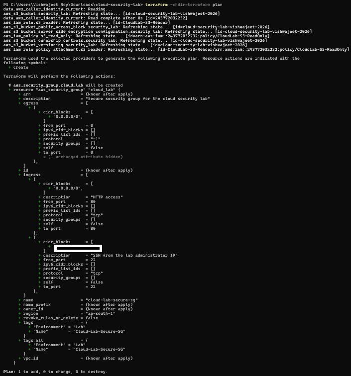
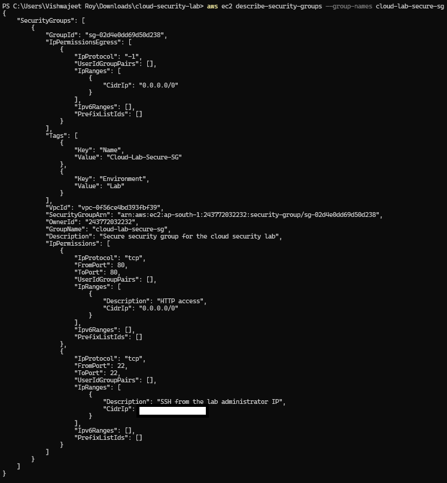
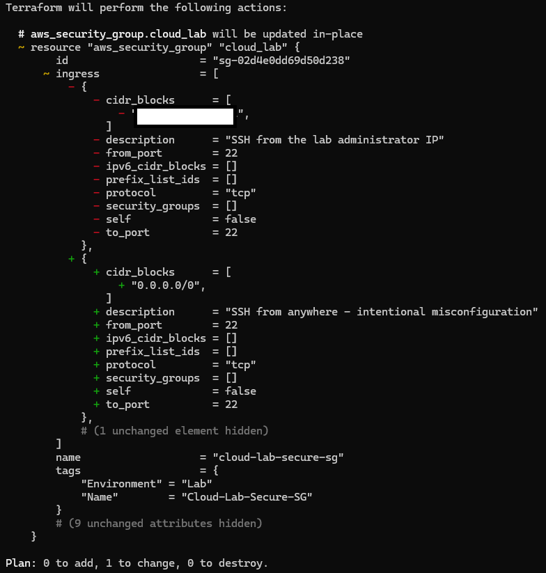
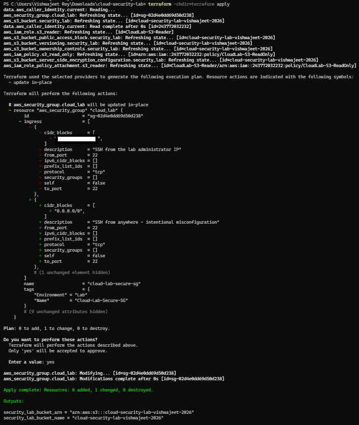
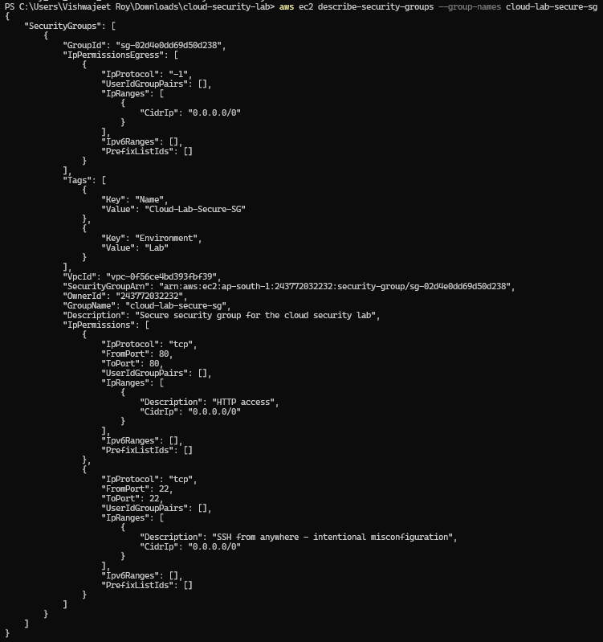
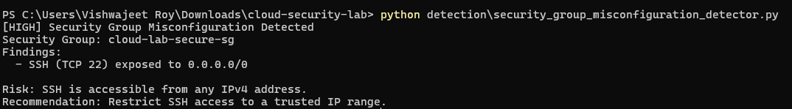
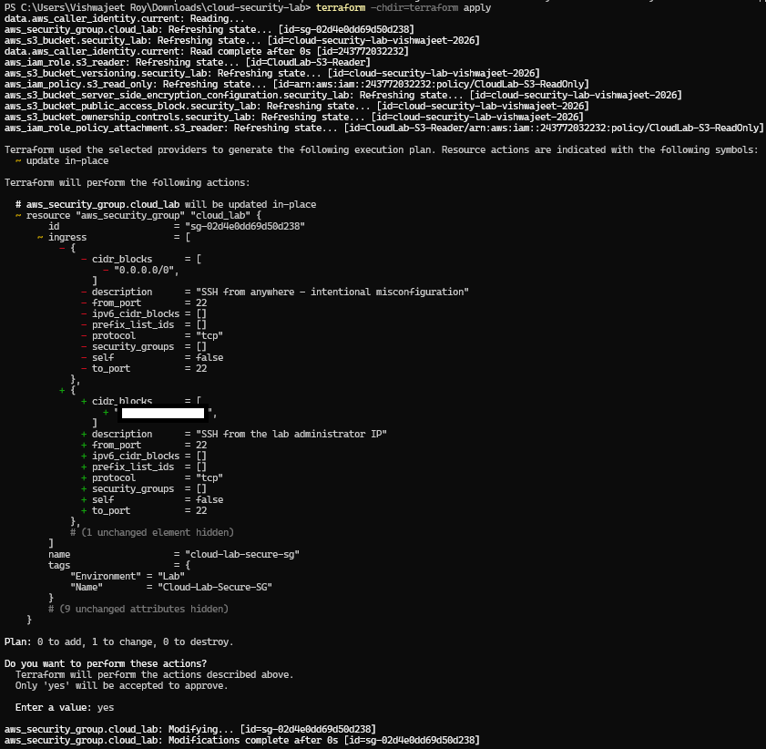
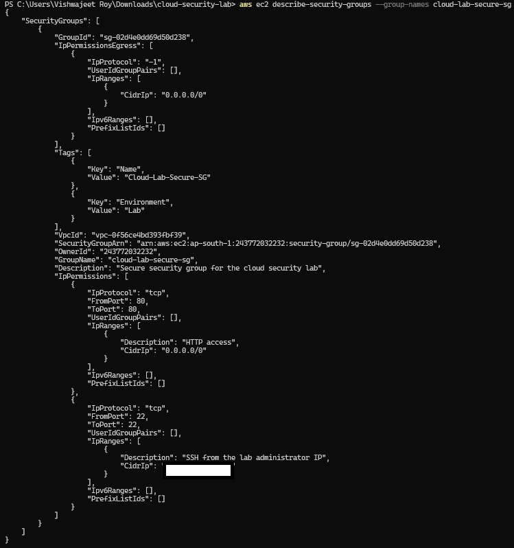
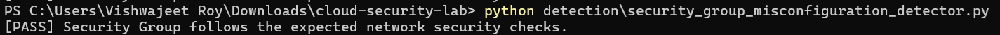

# Scenario 03 — Overly Permissive Security Group

## Objective

Identify and remediate an overly permissive AWS Security Group configuration that exposes SSH access to the entire internet.

This scenario demonstrates:

- Secure network-security configuration
- Intentional Security Group misconfiguration
- AWS configuration assessment
- Automated detection using Python/Boto3
- Terraform-based remediation
- Post-remediation verification

---

## Security Concept

An AWS **Security Group** acts as a virtual firewall for AWS resources.

It controls which inbound and outbound network traffic is allowed.

A common cloud security risk is allowing sensitive management services such as SSH to be accessed from anywhere on the internet.

The following rule is considered overly permissive:

```text
Protocol: TCP
Port: 22
Source: 0.0.0.0/0
```

`0.0.0.0/0` represents **all IPv4 addresses**.

For administrative SSH access, the secure baseline restricts access to the administrator's trusted public IP using a `/32` CIDR range.

---

## Architecture

```text
                         AWS Account
                              |
                              v
                     Security Group
                    cloud-lab-secure-sg
                              |
                 +------------+------------+
                 |                         |
                 v                         v
          Secure Baseline          Misconfigured State
            SSH → Admin IP           SSH → 0.0.0.0/0
                 |                         |
                 +------------+------------+
                              |
                              v
                      AWS CLI Assessment
                              |
                              v
                    Boto3 Detection Script
                              |
                              v
                         HIGH Finding
                              |
                              v
                    Terraform Remediation
                              |
                              v
                     Secure Configuration
                              |
                              v
                             PASS
```

---

# 1. Secure Security Group Baseline

The Security Group was provisioned using Terraform with restricted administrative SSH access.

The secure baseline allows:

```text
SSH (TCP 22) → Administrator IP/32
HTTP (TCP 80) → 0.0.0.0/0
```

SSH is restricted to a `/32` CIDR range so that only the trusted administrator IP can access the management service.

HTTP is intentionally available publicly because HTTP is a typical public-facing service.

### Terraform Secure Baseline Plan



The Terraform plan shows the Security Group being created with restricted SSH access.

### Secure Baseline Verification

After deployment, the Security Group was queried directly using the AWS CLI.



The live AWS configuration confirms that SSH is restricted to the administrator IP while HTTP remains publicly accessible.

---

# 2. Intentional Misconfiguration

To simulate a real-world cloud network security misconfiguration, the SSH rule was intentionally changed from the trusted administrator IP to:

```text
0.0.0.0/0
```

The resulting rule allows SSH connections from any IPv4 address.

The misconfigured rule was:

```text
Protocol: TCP
Port: 22
Source: 0.0.0.0/0
```

### Terraform Misconfiguration Plan



The Terraform plan shows the SSH source changing from the administrator's `/32` IP range to `0.0.0.0/0`.

### Misconfiguration Deployment

The intentional insecure configuration was applied to the AWS environment using Terraform.



---

# 3. Misconfiguration Verification

After deployment, the AWS CLI was used to inspect the live Security Group configuration.



The live configuration confirmed:

```text
TCP 22 → 0.0.0.0/0
```

This verifies that the insecure SSH rule was actually present in AWS rather than existing only in the Terraform configuration.

---

# 4. Automated Detection

A Python-based security detector was developed using **Boto3**.

The detector queries the Security Group configuration and checks for SSH exposure to the entire IPv4 internet.

### Detection Logic

The detector:

1. Connects to Amazon EC2 using Boto3.
2. Locates the target Security Group.
3. Retrieves its inbound rules.
4. Searches for TCP port 22.
5. Checks whether the source is `0.0.0.0/0`.
6. Generates a security finding if the rule is detected.
7. Provides a remediation recommendation.

### Detection Flow

```text
Python Script
     |
     v
   Boto3
     |
     v
AWS EC2 API
     |
     v
Retrieve Security Group Rules
     |
     v
Check TCP Port 22
     |
     +------------------------+
     |                        |
 Restricted              0.0.0.0/0
     |                        |
     v                        v
    PASS                  HIGH Finding
                              |
                              v
                         Remediation
```

### Detection Result



The detector identified the insecure SSH rule and reported:

```text
[HIGH] Security Group Misconfiguration Detected
```

The finding identified SSH on TCP port 22 as being exposed to `0.0.0.0/0`.

The detector recommended restricting SSH access to a trusted IP range.

---

# 5. Remediation

The Terraform configuration was restored to the secure baseline.

The SSH rule was changed from:

```text
0.0.0.0/0
```

back to:

```text
Administrator IP/32
```

The Terraform configuration therefore restored restricted administrative access.

### Remediation Plan



The Terraform plan shows the insecure SSH rule being replaced with the restricted administrator IP range.

---

# 6. Final Verification

After remediation, the Security Group was queried again using the AWS CLI.



The live AWS configuration confirmed that SSH was once again restricted to the administrator's `/32` IP range.

### Automated Post-Remediation Verification

The Boto3 detector was executed again after remediation.



The detector returned:

```text
[PASS] Security Group follows the expected network security checks.
```

This confirms that the overly permissive SSH rule was successfully remediated and the Security Group now satisfies the expected network-security checks.

---

# 7. Security Impact

Allowing SSH access from `0.0.0.0/0` significantly increases the attack surface of an AWS environment.

Potential risks include:

- Unauthorized SSH connection attempts
- Increased exposure to automated internet scanning
- Brute-force authentication attempts
- Exploitation of vulnerable SSH services
- Increased attack surface for administrative infrastructure

Restricting administrative access to trusted IP ranges follows the principle of **least privilege at the network layer**.

---

# 8. Tools Used

| Tool | Purpose |
|---|---|
| Amazon EC2 | Security Group infrastructure |
| Terraform | Infrastructure as Code and remediation |
| AWS CLI | Security Group configuration assessment |
| Python | Security automation |
| Boto3 | AWS API interaction |
| Git/GitHub | Version control and project documentation |

---

# 9. Scenario Workflow

```text
                  Secure SG Baseline
                         |
                         v
                 SSH Restricted to
                  Administrator IP
                         |
                         v
            Intentional Misconfiguration
                         |
                         v
                  SSH → 0.0.0.0/0
                         |
                         v
                AWS CLI Verification
                         |
                         v
               Boto3 Security Detector
                         |
                         v
                    HIGH Finding
                         |
                         v
                Terraform Remediation
                         |
                         v
              Restrict SSH to Admin IP
                         |
                         v
                 AWS Verification
                         |
                         v
                Automated Detection
                         |
                         v
                    Secure State
                         |
                         v
                        PASS
```

---

# 10. Key Takeaways

- AWS Security Groups provide network-level access control for cloud resources.
- Administrative services such as SSH should not normally be exposed to the entire internet.
- `0.0.0.0/0` represents all IPv4 addresses and can create an unnecessarily large attack surface.
- AWS configurations can be assessed programmatically using Boto3.
- Terraform provides a reproducible method for deploying and remediating cloud network configurations.
- Automated detection can identify overly permissive network rules.
- Post-remediation verification confirms that the intended secure configuration has actually been restored.

---

# Evidence Summary

| Stage | Evidence |
|---|---|
| Secure Security Group baseline | `security-group-secure-plan.png` |
| Secure baseline verification | `security-group-secure-verification.png` |
| Intentional misconfiguration | `security-group-misconfiguration-plan.png` |
| Misconfiguration deployed | `security-group-misconfiguration-deployed.png` |
| Misconfiguration verification | `security-group-misconfiguration-verified.png` |
| Automated detection | `security-group-misconfiguration-detected.png` |
| Remediation | `security-group-remediation-plan.png` |
| Remediation verification | `security-group-remediation-verified.png` |
| Post-remediation detection | `security-group-least-privilege-verified.png` |