# Scenario 04 — S3 Encryption Enforcement Misconfiguration

## Objective

Identify and remediate a missing S3 encryption-enforcement control using Terraform and automated security detection.

This scenario demonstrates:

- Secure S3 encryption configuration
- Explicit encryption enforcement using an S3 bucket policy
- Intentional removal of the encryption-enforcement control
- Automated detection using Python and Boto3
- Terraform-based remediation
- Post-remediation verification

---

## Security Concept

Amazon S3 automatically applies server-side encryption with SSE-S3 to new objects by default.

However, organizations can also implement explicit policy-level controls to enforce encryption requirements on object uploads.

This scenario focuses on enforcing the use of:

```text
AES256
```

for S3 object uploads.

The secure configuration uses an S3 bucket policy containing a `Deny` statement that rejects `PutObject` requests when the request does not specify:

```text
s3:x-amz-server-side-encryption = AES256
```

The intentionally vulnerable configuration removes this enforcement policy.

> **Important:** This scenario does not simulate an unencrypted S3 bucket. S3 continues to provide its default SSE-S3 encryption. The simulated security issue is the **absence of the explicit encryption-enforcement policy**.

---

## Architecture

```text
                         AWS Account
                              |
                              v
                         S3 Bucket
              cloud-security-lab-vishwajeet-2026
                              |
                +-------------+-------------+
                |                           |
                v                           v
        Secure Configuration        Misconfigured State
                |                           |
                v                           v
       Encryption Enforcement       Enforcement Policy
            Policy Removed
                |                           |
                +-------------+-------------+
                              |
                              v
                       Boto3 Detector
                              |
                              v
                       Security Finding
                              |
                              v
                     Terraform Remediation
                              |
                              v
                  Restore Encryption Policy
                              |
                              v
                       AWS Verification
                              |
                              v
                             PASS
```

---

# 1. Secure Configuration

## S3 Server-Side Encryption

The S3 bucket was configured with server-side encryption using SSE-S3.

The encryption configuration specifies:

```text
SSEAlgorithm = AES256
```

The configuration was verified using the AWS CLI.

### Evidence

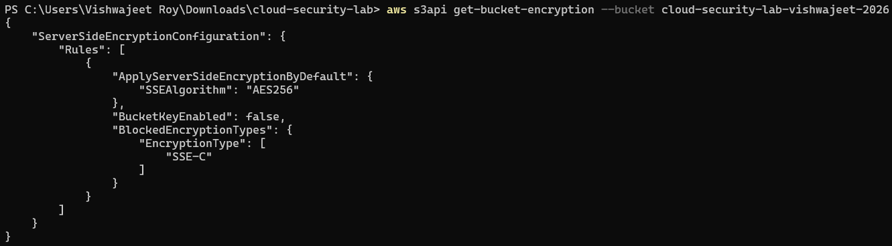

---

## Encryption Enforcement Policy

An explicit S3 bucket policy was created using Terraform to enforce encryption requirements for object uploads.

The policy denies `s3:PutObject` requests when the request does not specify:

```text
s3:x-amz-server-side-encryption = AES256
```

The policy contains the following security control:

```text
Sid = DenyUnencryptedObjectUploads
```

The Terraform policy uses:

```hcl
Condition = {
  StringNotEquals = {
    "s3:x-amz-server-side-encryption" = "AES256"
  }
}
```

This provides an additional policy-level security control over the bucket's encryption requirements.

### Terraform Plan

The Terraform plan showed the encryption-enforcement policy being created.

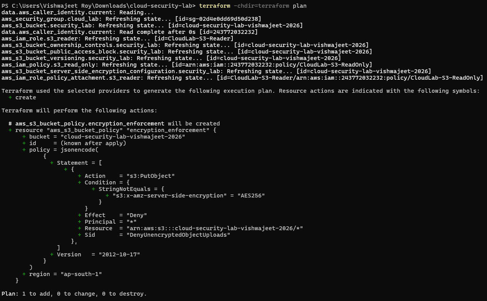

### Deployment

The encryption-enforcement policy was successfully deployed using Terraform.

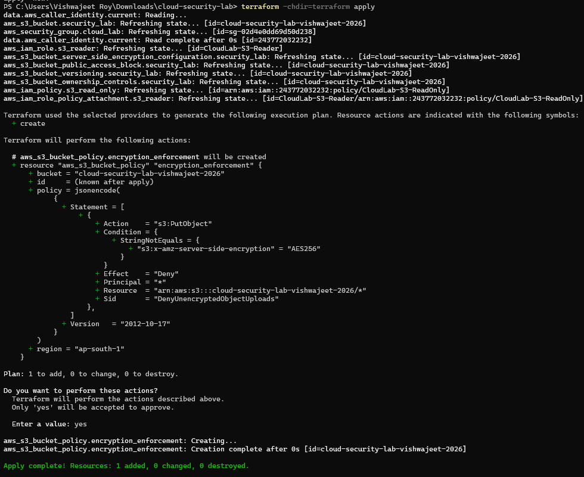

### Policy Verification

The deployed bucket policy was verified using the AWS CLI.

The policy contained:

```text
Sid      = DenyUnencryptedObjectUploads
Effect   = Deny
Action   = s3:PutObject
```

and required:

```text
s3:x-amz-server-side-encryption = AES256
```

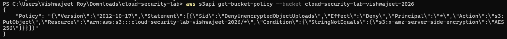

---

# 2. Intentional Misconfiguration

To simulate a real-world cloud security control failure, the encryption-enforcement bucket policy was intentionally removed from the Terraform configuration.

The policy:

```text
DenyUnencryptedObjectUploads
```

was removed from the configuration.

This caused the live S3 bucket to lose the expected policy-level enforcement requiring upload requests to explicitly specify AES256 encryption.

The underlying S3 default encryption remained enabled.

## Security Risk

Although S3 continues to provide default server-side encryption, removing an explicit organizational enforcement policy weakens the intended security baseline.

Without the policy-level control:

- The expected encryption requirement is no longer explicitly enforced.
- Security requirements become more dependent on default service behavior.
- Configuration drift can occur.
- The infrastructure no longer matches the intended security baseline.
- An additional layer of defense-in-depth is removed.

### Terraform Misconfiguration Plan

The Terraform plan showed the encryption-enforcement policy being removed.

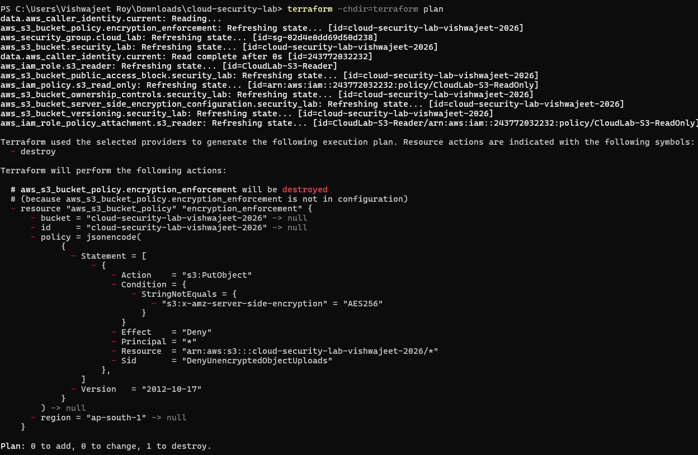

### Misconfiguration Deployment

The policy removal was applied using Terraform.

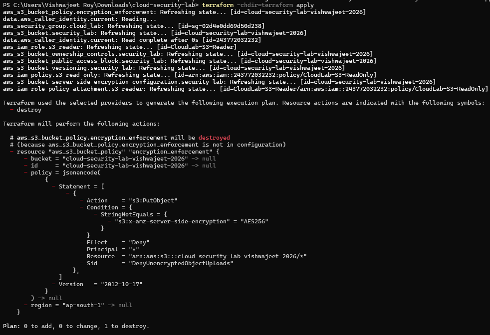

---

# 3. Misconfiguration Verification

The live S3 configuration was queried using:

```powershell
aws s3api get-bucket-policy --bucket cloud-security-lab-vishwajeet-2026
```

AWS returned:

```text
NoSuchBucketPolicy
```

indicating that the bucket no longer had a bucket policy.

This confirmed that the expected encryption-enforcement control had been removed from the live AWS environment.

### Evidence

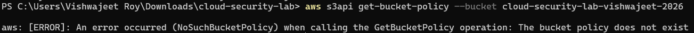

---

# 4. Detection

A Python-based security detector was developed using Boto3 to identify the missing encryption-enforcement control.

The detector is located at:

```text
detection/s3_encryption_detector.py
```

## Detection Logic

The detector:

1. Connects to Amazon S3 using Boto3.
2. Queries the bucket policy.
3. Checks whether a bucket policy exists.
4. Checks for the expected encryption-enforcement control.
5. Generates a security finding if the control is missing.
6. Provides a risk description.
7. Provides a remediation recommendation.

## Detection Flow

```text
Python Detector
      |
      v
    Boto3
      |
      v
   S3 API
      |
      v
Get Bucket Policy
      |
      +----------------------+
      |                      |
 Policy Exists          Policy Missing
      |                      |
      v                      v
Check Required           HIGH Finding
Encryption Control           |
      |                      |
      +----------+-----------+
                 |
                 v
       Remediation Recommendation
```

## Detection Result

The detector identified the missing encryption-enforcement control and generated:

```text
[HIGH] S3 Encryption Enforcement Misconfiguration Detected
```

The finding reported:

```text
Finding:
  - No bucket policy exists.
```

The detector also reported the associated risk and remediation recommendation.

### Evidence

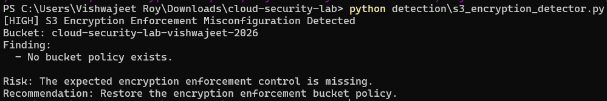

---

# 5. Remediation

The Terraform configuration was restored to the secure encryption-enforcement policy.

The policy was recreated with:

```text
Effect = Deny
Action = s3:PutObject
```

and the encryption condition:

```text
s3:x-amz-server-side-encryption = AES256
```

This restored the expected policy-level encryption enforcement.

## Remediation Plan

The Terraform plan showed the encryption-enforcement bucket policy being recreated.

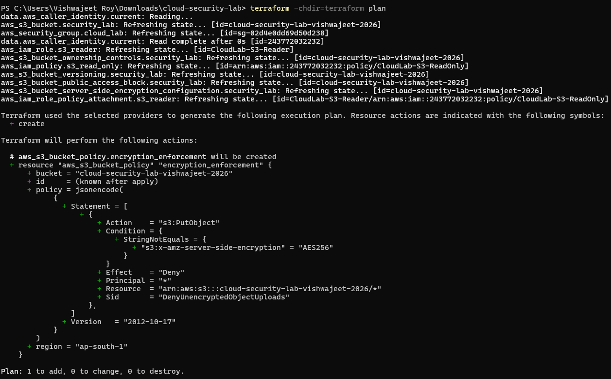

## Remediation Deployment

Terraform successfully recreated the encryption-enforcement policy.

The resource was added successfully without modifying or destroying the S3 bucket itself.

## Remediation Verification

The deployed bucket policy was queried using the AWS CLI.

The policy was confirmed to contain:

```text
DenyUnencryptedObjectUploads
```

with:

```text
Effect = Deny
Action = s3:PutObject
```

and the expected AES256 encryption condition.

### Evidence

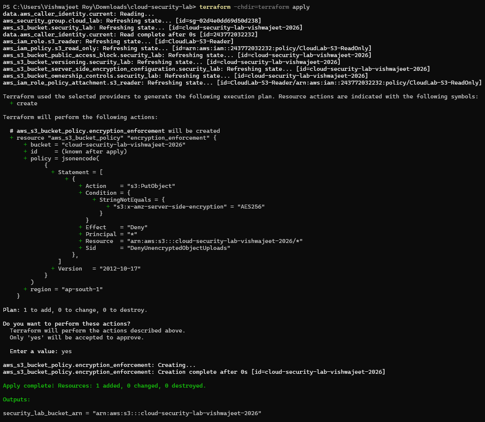

---

# 6. Final Verification

After remediation, the automated detector was executed again against the live AWS configuration.

The detector returned:

```text
[PASS] S3 encryption enforcement policy is configured.
```

This confirms that the missing security control was successfully restored.

### Evidence

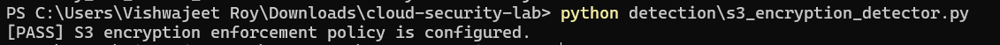

---

# 7. Security Impact

The removal of an explicit encryption-enforcement policy weakens the intended S3 security baseline.

Potential security impacts include:

- Reduced enforcement of organizational encryption requirements
- Increased reliance on default cloud-service behavior
- Configuration drift between intended and deployed security controls
- Reduced defense-in-depth for stored data
- Increased difficulty detecting policy-level security gaps without automated monitoring

Maintaining explicit encryption policies ensures that security requirements are enforced consistently through Infrastructure as Code and AWS resource policies.

---

# 8. Tools Used

| Tool | Purpose |
| --- | --- |
| Amazon S3 | Cloud storage and encryption configuration |
| Terraform | Infrastructure as Code and remediation |
| AWS CLI | AWS configuration verification |
| Python | Security automation |
| Boto3 | AWS API interaction |
| Git/GitHub | Version control and documentation |

---

# 9. Scenario Workflow

```text
                 Secure S3 Configuration
                          |
                          v
                    SSE-S3 / AES256
                          |
                          v
              Encryption Enforcement Policy
                          |
                          v
               Intentional Misconfiguration
                          |
                          v
                Remove Enforcement Policy
                          |
                          v
                  AWS Configuration Check
                          |
                          v
                  Boto3 Security Detector
                          |
                          v
                     HIGH Finding
                          |
                          v
                  Terraform Remediation
                          |
                          v
             Restore Encryption Enforcement
                          |
                          v
                  AWS Policy Verification
                          |
                          v
                  Boto3 Detector Re-run
                          |
                          v
                         PASS
```

---

# 10. Key Takeaways

- Amazon S3 provides default server-side encryption using SSE-S3.
- Explicit bucket policies can provide an additional layer of encryption enforcement.
- Terraform can be used to deploy and restore cloud security controls consistently.
- AWS CLI can independently verify the actual deployed configuration.
- Boto3 can automate security assessments against live AWS resources.
- Removing an explicit security control can create configuration drift even when the underlying AWS service still provides a security baseline.
- Automated detection can identify missing security controls.
- Terraform provides a repeatable remediation mechanism.
- Post-remediation verification confirms that the intended security control has been restored.

---

# Evidence Summary

| Stage | Evidence |
| --- | --- |
| Secure S3 encryption configuration | [s3-encryption-secure-verification.png](../../screenshots/s3-encryption-secure-verification.png) |
| Secure encryption policy plan | [s3-encryption-secure-plan.png](../../screenshots/s3-encryption-secure-plan.png) |
| Secure encryption policy deployment | [s3-encryption-secure-deployed.png](../../screenshots/s3-encryption-secure-deployed.png) |
| Encryption policy verification | [s3-encryption-policy-verified.png](../../screenshots/s3-encryption-policy-verified.png) |
| Intentional misconfiguration plan | [s3-encryption-misconfiguration-plan.png](../../screenshots/s3-encryption-misconfiguration-plan.png) |
| Misconfiguration deployment | [s3-encryption-misconfiguration-deployed.png](../../screenshots/s3-encryption-misconfiguration-deployed.png) |
| Misconfiguration verification | [s3-encryption-misconfiguration-verified.png](../../screenshots/s3-encryption-misconfiguration-verified.png) |
| Automated detection | [s3-encryption-misconfiguration-detected.png](../../screenshots/s3-encryption-misconfiguration-detected.png) |
| Remediation plan | [s3-encryption-remediation-plan.png](../../screenshots/s3-encryption-remediation-plan.png) |
| Remediation verification | [s3-encryption-remediation-verified.png](../../screenshots/s3-encryption-remediation-verified.png) |
| Final verification | [s3-encryption-enforcement.png](../../screenshots/s3-encryption-enforcement.png) |