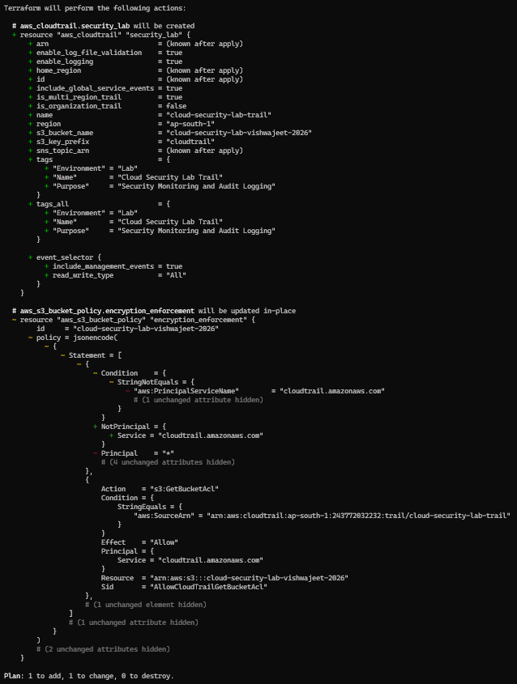
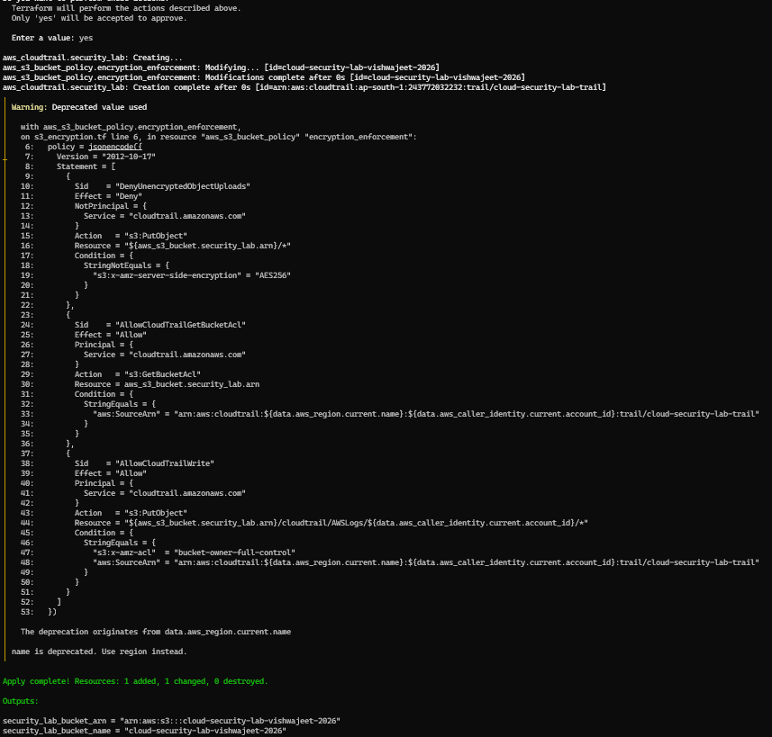
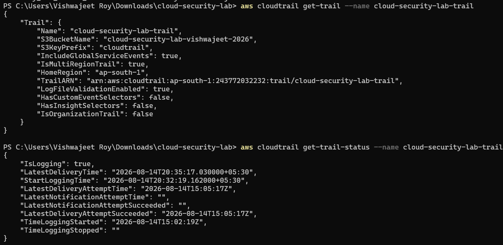
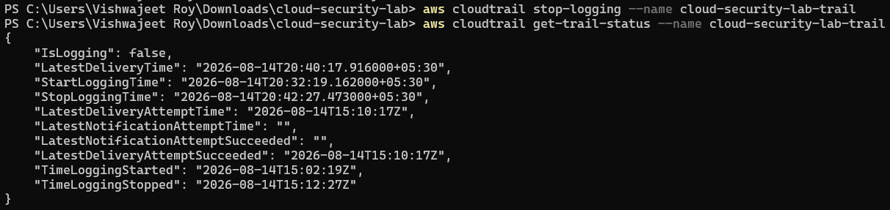
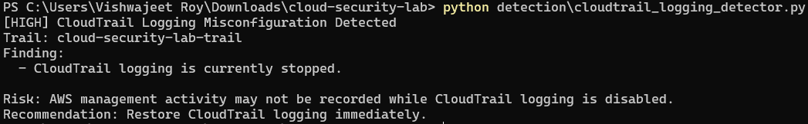
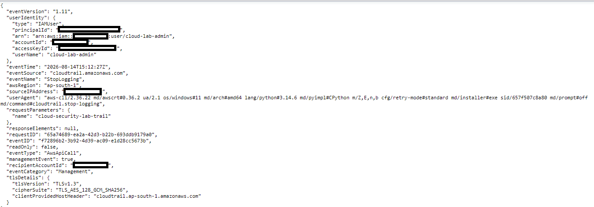
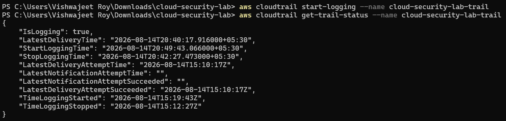
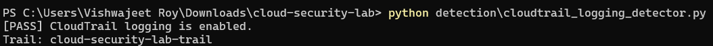
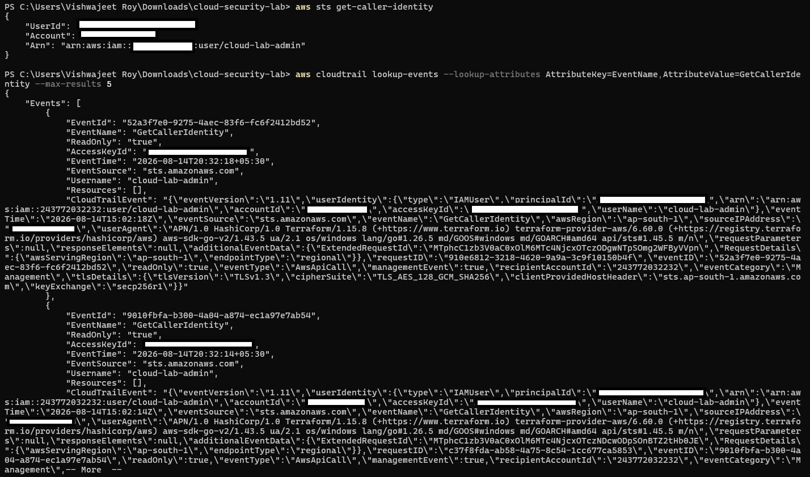

# Scenario 05 — CloudTrail Logging & Monitoring Misconfiguration

## Objective

Identify and remediate a CloudTrail logging misconfiguration using Terraform, AWS CLI, and automated Python-based security detection.

This scenario demonstrates:

- CloudTrail management event logging
- Multi-Region CloudTrail configuration
- S3-based CloudTrail log delivery
- CloudTrail log-file validation
- Intentional CloudTrail logging disruption
- Automated detection using Python and Boto3
- SOC-style investigation of a `StopLogging` API event
- Restoration of CloudTrail logging
- Post-remediation verification

---

## Security Concept

AWS CloudTrail records API activity and other management events within an AWS environment.

For a security monitoring environment, CloudTrail provides an important audit trail that allows security teams to investigate:

- Who performed an action
- What API action was performed
- When the action occurred
- Where the request originated
- Which AWS service was targeted
- What resources or parameters were involved

This scenario focuses on a critical monitoring failure:

```text
CloudTrail logging is stopped
```

When logging is disabled, subsequent AWS management activity may not be recorded by the trail, creating a visibility gap for security monitoring and incident investigation.

The scenario intentionally stops the CloudTrail trail, detects the condition, investigates the `StopLogging` API event, and restores logging.

> **Important:** The scenario does not delete the CloudTrail trail. The trail remains configured, but its active logging state is intentionally changed to `false`.

---

## Architecture

```text
                         AWS Account
                              |
                              v
                       CloudTrail Trail
                    cloud-security-lab-trail
                              |
                    +---------+---------+
                    |                   |
                    v                   v
             Management Events    Log Validation
                    |
                    v
                 S3 Bucket
     cloud-security-lab-vishwajeet-2026
                    |
                    v
              CloudTrail Logs
                    |
                    v
             SOC Investigation
                    |
                    v
          Detection / Alerting Script
                    |
                    v
              Security Finding
                    |
                    v
               Remediation
                    |
                    v
           Logging Restored
                    |
                    v
           Final Verification
```

---

# 1. Secure Configuration

## CloudTrail Trail

A CloudTrail trail was configured using Terraform with:

```text
Trail Name                    = cloud-security-lab-trail
Region                        = ap-south-1
Multi-Region Trail            = Enabled
Global Service Events         = Enabled
Management Events             = Enabled
Read Events                   = Enabled
Write Events                  = Enabled
Log File Validation           = Enabled
S3 Destination                = cloud-security-lab-vishwajeet-2026
S3 Key Prefix                 = cloudtrail
```

The trail records AWS management activity and delivers CloudTrail logs to the existing security lab S3 bucket.

The Terraform configuration uses:

```hcl
include_global_service_events = true
is_multi_region_trail         = true
enable_log_file_validation    = true

event_selector {
  read_write_type           = "All"
  include_management_events = true
}
```

---

## Terraform Plan

The Terraform plan showed the CloudTrail trail being created with the intended security configuration.

### Evidence



---

## CloudTrail Deployment

Terraform successfully created the CloudTrail trail.

### Evidence



---

## CloudTrail Configuration Verification

The deployed CloudTrail configuration was verified using the AWS CLI.

The verification confirmed:

```text
IncludeGlobalServiceEvents = true
IsMultiRegionTrail         = true
LogFileValidationEnabled   = true
S3BucketName               = cloud-security-lab-vishwajeet-2026
S3KeyPrefix                = cloudtrail
```

### Evidence



---

## CloudTrail Log Delivery

CloudTrail logs were verified in the S3 bucket under the configured:

```text
cloudtrail/
```

prefix.

This confirms that the trail was not only configured but was actively delivering audit logs to the S3 destination.

### Evidence


---

# 2. Intentional Misconfiguration

To simulate a real-world security monitoring failure, CloudTrail logging was intentionally stopped.

The trail itself remained present and correctly configured, but its active logging state was changed:

```text
IsLogging = false
```

This creates a configuration drift condition between the intended secure state and the live AWS state.

The intended state is:

```text
CloudTrail trail exists
        +
Logging enabled
```

The simulated insecure state is:

```text
CloudTrail trail exists
        +
Logging disabled
```

---

## Stopping CloudTrail Logging

The logging state was intentionally changed using:

```powershell
aws cloudtrail stop-logging --name cloud-security-lab-trail
```

The live status was then checked using:

```powershell
aws cloudtrail get-trail-status --name cloud-security-lab-trail
```

The AWS CLI returned:

```text
"IsLogging": false
```

### Evidence



---

# 3. Detection

A Python-based security detector was developed using Boto3 to identify whether the expected CloudTrail trail is actively logging.

The detector is located at:

```text
detection/cloudtrail_logging_detector.py
```

## Detection Logic

The detector:

1. Connects to AWS CloudTrail using Boto3.
2. Queries the status of the expected trail.
3. Checks the `IsLogging` value.
4. Generates a high-severity finding when logging is stopped.
5. Provides a risk description.
6. Provides a remediation recommendation.
7. Returns a non-zero exit status when the security control fails.

## Detection Flow

```text
Python Detector
      |
      v
    Boto3
      |
      v
CloudTrail API
      |
      v
Get Trail Status
      |
      +----------------------+
      |                      |
 IsLogging = true      IsLogging = false
      |                      |
      v                      v
    PASS                 HIGH Finding
                             |
                             v
                   Remediation Recommendation
```

---

## Detection Result

The detector identified the stopped logging state and generated:

```text
[HIGH] CloudTrail Logging Misconfiguration Detected
```

The finding reported:

```text
Finding:
  - CloudTrail logging is currently stopped.
```

The detector also reported the associated risk:

```text
AWS management activity may not be recorded while CloudTrail logging is disabled.
```

### Evidence



---

# 4. SOC Investigation

The scenario also demonstrates a SOC-style investigation of the event responsible for the monitoring disruption.

The AWS CLI was used to search CloudTrail Event History for the:

```text
StopLogging
```

API event.

The investigation command was:

```powershell
aws cloudtrail lookup-events --lookup-attributes AttributeKey=EventName,AttributeValue=StopLogging --max-results 5
```

The full CloudTrail event was then extracted using:

```powershell
aws cloudtrail lookup-events --lookup-attributes AttributeKey=EventName,AttributeValue=StopLogging --max-results 1 --query "Events[0].CloudTrailEvent" --output text
```

The resulting event contained security-relevant fields including:

```text
eventTime
eventSource
eventName
awsRegion
sourceIPAddress
userIdentity
requestParameters
eventType
managementEvent
```

These fields provide the information a SOC analyst can use to investigate an AWS configuration change.

### Investigation Evidence



---

## SOC Investigation Flow

```text
CloudTrail Logging Stopped
          |
          v
Security Detection
          |
          v
Identify StopLogging Event
          |
          +------------------+
          |                  |
          v                  v
       Who?               When?
          |                  |
          +--------+---------+
                   |
                   v
                Where?
                   |
                   v
             What API Action?
                   |
                   v
             Assess Impact
                   |
                   v
                Remediate
```

This demonstrates how CloudTrail can support both **security posture monitoring** and **SOC investigation**.

---

# 5. Remediation

The CloudTrail logging state was restored using the AWS CLI:

```powershell
aws cloudtrail start-logging --name cloud-security-lab-trail
```

The trail status was then verified.

The resulting state was:

```text
"IsLogging": true
```

This restored the active CloudTrail monitoring capability.

### Evidence



---

# 6. Final Verification

After remediation, the automated detector was executed again:

```powershell
python detection\cloudtrail_logging_detector.py
```

The detector returned:

```text
[PASS] CloudTrail logging is enabled.
Trail: cloud-security-lab-trail
```

This confirms that the security control has been successfully restored.

### Evidence



---

## Post-Remediation Event Verification

After logging was restored, an AWS API request was generated:

```powershell
aws sts get-caller-identity
```

CloudTrail Event History was then queried for the resulting:

```text
GetCallerIdentity
```

management event.

The returned event demonstrated that AWS API activity was being recorded after CloudTrail logging was restored.

### Evidence



---

# 7. Security Impact

Stopping CloudTrail logging creates a significant security monitoring gap.

Potential impacts include:

- Reduced visibility into AWS API activity
- Inability to reliably investigate activity occurring during the logging gap
- Reduced auditability of administrative actions
- Increased difficulty detecting unauthorized cloud activity
- Potential loss of forensic evidence
- Reduced effectiveness of SOC monitoring and incident response

Maintaining active CloudTrail logging is therefore an important security monitoring control.

---

# 8. Tools Used

| Tool | Purpose |
| --- | --- |
| AWS CloudTrail | AWS API activity and audit logging |
| Amazon S3 | CloudTrail log storage |
| Terraform | Infrastructure as Code and secure baseline configuration |
| AWS CLI | CloudTrail configuration, status, and event verification |
| Python | Security automation |
| Boto3 | CloudTrail API interaction and detection |
| Git/GitHub | Version control and documentation |

---

# 9. Scenario Workflow

```text
                  Secure Configuration
                         |
                         v
                 Create CloudTrail
                         |
                         v
              Enable Management Events
                         |
                         v
               Enable Log Validation
                         |
                         v
                 Deliver Logs to S3
                         |
                         v
              Verify Logging is Active
                         |
                         v
             Intentional Misconfiguration
                         |
                         v
                 Stop CloudTrail
                         |
                         v
              Verify IsLogging = false
                         |
                         v
                 Run Detection Script
                         |
                         v
                    HIGH Finding
                         |
                         v
              Investigate StopLogging
                         |
                         v
                Identify API Event
                         |
                         v
                    Remediation
                         |
                         v
               Start CloudTrail Logging
                         |
                         v
              Verify IsLogging = true
                         |
                         v
                  Run Detector
                         |
                         v
                       PASS
                         |
                         v
              Verify New API Event
```

---

# 10. Key Takeaways

- CloudTrail provides audit visibility into AWS management activity.
- Multi-Region trails provide broader visibility across AWS Regions.
- Management events capture important AWS API activity such as IAM, security, and configuration changes.
- Log-file validation provides an additional integrity control for delivered CloudTrail logs.
- S3 provides durable storage for CloudTrail audit logs.
- Disabling CloudTrail logging creates a security monitoring gap.
- Automated Boto3 detection can identify when expected logging controls are disabled.
- CloudTrail Event History can be used to investigate administrative API activity.
- The `StopLogging` event provides useful SOC investigation data such as the event time, identity, source IP, AWS Region, and API action.
- Restoring CloudTrail logging re-establishes the monitoring control.
- Post-remediation event verification confirms that AWS activity is being recorded again.
- The scenario demonstrates an end-to-end **Detect → Investigate → Remediate → Verify** workflow.

---

# Evidence Summary

| Stage | Evidence |
| --- | --- |
| Secure CloudTrail Terraform plan | [cloudtrail-secure-plan.png](../../screenshots/cloudtrail-secure-plan.png) |
| Secure CloudTrail deployment | [cloudtrail-secure-deployed.png](../../screenshots/cloudtrail-secure-deployed.png) |
| Secure CloudTrail configuration verification | [cloudtrail-secure-verification.png](../../screenshots/cloudtrail-secure-verification.png) |
| CloudTrail logging misconfiguration verification | [cloudtrail-misconfiguration-verified.png](../../screenshots/cloudtrail-misconfiguration-verified.png) |
| Automated misconfiguration detection | [cloudtrail-misconfiguration-detected.png](../../screenshots/cloudtrail-misconfiguration-detected.png) |
| SOC investigation of `StopLogging` event | [cloudtrail-stop-logging-investigation.png](../../screenshots/cloudtrail-stop-logging-investigation.png) |
| CloudTrail remediation verification | [cloudtrail-remediation-verified.png](../../screenshots/cloudtrail-remediation-verified.png) |
| Final detector verification | [cloudtrail-logging-enforcement.png](../../screenshots/cloudtrail-logging-enforcement.png) |
| Post-remediation CloudTrail event | [cloudtrail-post-remediation-event.png](../../screenshots/cloudtrail-post-remediation-event.png) |